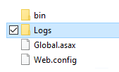
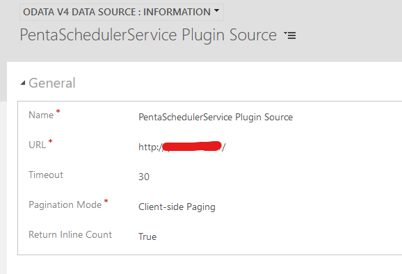

# PentaWork Scheduler for Dynamics 365 & Power Platform

This repository contains the code for the *PentaWork Scheduler*.
The scheduler enables a power user to plan background jobs within a Dynamics/Power Platform organization.

## Installation

### Solution

Download a release version of the solution and install it like any other XRM solution. After installation you should be able to find the **Penta Schedules** in the advanced find. Integrate it to your sitemap for easy access.


### Background Service Installation (optional)

Asynchronous tasks unfortunately have a few limitations within the sandbox to improve system stability.

- Background tasks are automatically terminated after five minutes
- Plugins and background tasks that trigger other plugins or workflows (e.g. child workflows) get the same Correlation ID within a certain time span (one hour). If the execution depth reaches a depth of eight the background task is automatically aborted
- Some .NET functionalities like sending emails do not work

To perform tasks that bypass these restrictions, a background service can be installed. The service is executed within the IIS.

It is recommended to create a separate application pool for the service. This will ensure that the service does not interfere with any other application in the event of an error. **The identity user must have access to the CRM system!**


The IIS website to be created should then use the new application pool and the binding should be selected according to the current environment. Then the service can be copied to the application folder and the connection string in web.config can be adjusted.


Additional you have to execute the following script to configure the warmup functionality for the new site.

```ps
.\configureWarmup.ps1 [SITENAME]
```

After that, the service can be checked by visiting the new website. This should look similar to the following screenshot (in Firefox - other browsers may display the metadata differently).


A **Logs** folder should have been created in the website folder. If this is not the case, the write permission for the identity user may have to be granted.



In addition, the webhooks must be configured correctly. To do this, open the environment in the plugin registration tool and select the webhooks. Here you have to enter the correct URL to the web server as well as the API key (default is **123**), which can be configured in the web.config.


Lastly, the URL of the data source for the virtual entities needs to be customized. Enter the URL of your newly created website!




## Configuration


Each configuration consists of several parameters. First, each new configuration needs a name. Then the type of task must be specified.

The following options are available for this purpose:

- **Action** - *Execute an action for the entities specified in the FetchXML*
- **Workflow** - *Execute a workflow for the entities specified in FetchXML*
- **Global Action** - *Execute a Global Action - No FetchXML required*
- **Schedule Plugin** - *Execute a background service plugin. This is executed in the background service of the scheduler*

The frequency can be used to specify how often a task should be executed. After that only a start date is missing, which can be used to define when the task should be executed for the first time.

With the help of the *End Date* a date can be specified at which the task should be executed the last time.

**If a type has been selected that requires a FetchXML, this must be specified in the next tab!**

The FetchXML needs the **count** attribute to work correctly. The following is an example:

```xml
<fetch version="1.0" count="100" output-format="xml-platform" mapping="logical" distinct="false">
  <entity name="transactioncurrency">
    <attribute name="transactioncurrencyid"/>
    <attribute name="currencyname"/>
    <attribute name="isocurrencycode"/>
    <attribute name="currencysymbol"/>
    <attribute name="exchangerate"/>
    <attribute name="currencyprecision"/>
    <order attribute="currencyname" descending="false"/>
  </entity>
</fetch>
```

Unfortunately, the classic view is still recommended for viewing the tasks at present, since the background processes triggered by the tasks cannot be displayed in the Unified Interface.

### Error Handling

The scheduler comes with an optional error handling. Here it is possible to define, if a retry should be executed in case of any errors and, if a email should be send in case all retries are failing (schedule enters error state).


- **Retry on error** - *If yes, the schedule will be restarted in case of any errors*
- **Retry immediately** - *If yes, the next try will start ~5 minutes after the error. Otherwise the next try will be scheduled as if the schedule ended without an error (defined by the frequency of the schedule)*
- **Error Threshold** - *Defines the number of retries, before the schedule enters the error state*
- **Email in error** - *If yes, an error email gets send as soon as the schedule enters the error state*
- **Error Email Address** - *The recipient email address for the generated error email. The sender will be the owner of the schedule workflow (the user which installed the solution - you are able to reassign the workflow to another user). Make sure that this owner has a working mailbox in the crm system.*

## Development

It is possible to develop two kinds of plugins for the background service:

- **Scheduler Plugin** - *These are plugins which can be triggered by a schedule of type **Schedule Plugin***
- **Service Plugin** - *These are plugins which can be triggered by a call to the **PentaWork.Xrm.SchedulerService.Plugins** webhook. It is possible to triggere these directly by a plugin, workflow or action.  Synchronous and asynchronous.*

To develop a plugin you have to install the **PentaWork.Xrm.SchedulerService.Contracts** nuget.

### Powershell Scripts

The repository contains a few different powershell scripts to automate common tasks. It is necessary to install the following two modules:

```ps
Install-Module -Name PentaWork.Xrm.PowerShell 
Install-Module -Name 7Zip4Powershell
```

- ps-updateProxies.ps1  
**Updates the used proxy and test classes from a given organization (interactive)**
- ps-buildAssembly.ps1  
**Builds a release version of the plugin dll**
- ps-publishAssembly.ps1  
**Publishes the release dll to a given organization (interactive)**
- ps-exportSolution.ps1  
**Downloads the scheduler solution from a given organization and extracts it to the solution folder of the repository (interactive)**
- ps-importSolution.ps1  
**Zip the content of the solution folder and imports the resulting solution (unmanged) to a given organization (interactive)**